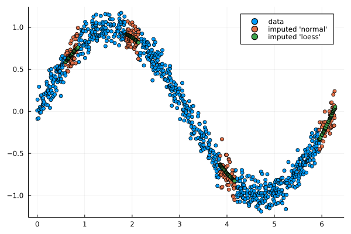

# DataWrangler

> :warning: Under development

Data wrangling refers to a number of processes designed to clean and transform data into into analytics ready datasets.

This package provides the following functionality to wrangle data:

- boxcox, iboxcox:         Box-Cox and inverse Box-Cox transformation
- d, p:                    Finite lagged difference and partial difference and its inverse
- impute, impute!:         Data imputation (loess inter/extra-polation, random local density)
- inlie, inlie!:           Removal of outliers 
- normalize, normalize!:   Data normalization (z-score, min-max, softmax, sigmoid)

