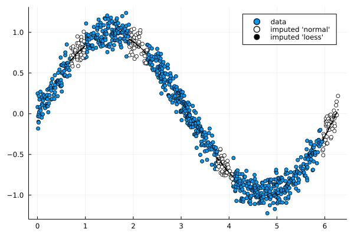

# DataWrangler

Data wrangling refers to a number of processes designed to clean and transform data into into analytics ready datasets.

This package provides the following functionality to wrangle data:

- Box-Cox and inverse Box-Cox transformation and estimation: `boxcox`, `iboxcox`                   
- Data imputation (loess inter/extra-polation, random local density): `impute`, `impute!`
- Data normalization (z-score, min-max, softmax, sigmoid): `normalize`, `normalize!`
- Finite lagged difference and partial difference and its inverse: `d`, `p`

## Example

```julia
using Plots
n = 1000
x = sort(rand(n))*2*pi;
y = Array{Union{Missing,Float64}}(undef,n);
y[:] = sin.(x).+randn(n)/10;
mid = vcat(100:150,300:350,600:650,950:1000);

y[mid] .= missing;
scatter(x,y; label="data")

ipy = impute(x,y; method = "normal")
scatter!(x[mid],ipy[mid]; label = "imputed 'normal'", color=:yellow)

ipy = impute(x,y)
scatter!(x[mid],ipy[mid]; label = "imputed 'loess'", color=:black)
```


[](https://github.com/viraltux/DataWrangler.jl/actions)
[](https://codecov.io/gh/viraltux/DataWrangler.jl)
